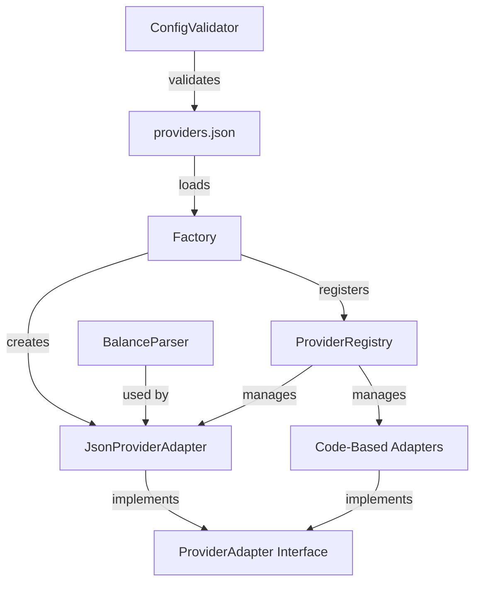

# Design Document: JSON Provider Configuration

## Overview

This design document specifies the architecture for a JSON-based provider configuration system that enables adding new utility providers through declarative configuration files instead of implementing code-based adapters. The system maintains full backward compatibility with existing code-based adapters while providing a flexible, declarative approach for new providers.

The core innovation is the JsonProviderAdapter class, which implements the ProviderAdapter interface using configuration-driven logic. This allows system administrators to add support for new utility providers by creating JSON configuration files without writing TypeScript code.

### Key Design Goals

1. **Declarative Configuration**: Define provider behavior through JSON rather than code
2. **Backward Compatibility**: Existing code-based adapters continue working unchanged
3. **Flexible Parsing**: Support both HTML (CSS selectors) and JSON (JSONPath) response formats
4. **Robust Error Handling**: Graceful degradation with comprehensive logging
5. **Configuration Validation**: Detect errors at startup before affecting users
6. **Testability**: Enable round-trip testing of configurations with sample data

## Architecture

### System Components

The system consists of five primary components:



1. **providers.json**: Configuration file containing provider definitions
2. **ConfigValidator**: Validates configuration structure and content at load time
3. **JsonProviderAdapter**: Generic adapter that implements ProviderAdapter using configuration
4. **BalanceParser**: Extracts balance data from HTML or JSON responses
5. **Factory**: Loads configurations and registers adapters with the registry

### Configuration File Structure

The `providers.json` file contains an array of provider configurations:

```json
{
  "providers": [
    {
      "id": "example-provider",
      "name": "example-provider",
      "displayName": "Example Utility Provider",
      "type": "gas",
      "regions": ["Tbilisi", "Batumi"],
      "accountValidation": {
        "pattern": "^\\d{12}$",
        "formatDescription": "12 digits"
      },
      "api": {
        "endpoint": "https://example.com/api/balance?account={{accountNumber}}",
        "method": "GET",
        "headers": {
          "User-Agent": "GeorgiaUtilityMonitor/1.0"
        }
      },
      "parsing": {
        "responseType": "html",
        "cssSelectors": {
          "balance": ".balance-amount",
          "currency": ".currency-code",
          "dueDate": ".due-date"
        }
      },
      "retry": {
        "maxRetries": 3,
        "retryDelays": [1000, 2000, 4000],
        "useExponentialBackoff": true
      }
    }
  ]
}
```

### Data Flow

1. **Initialization**: Factory loads providers.json and validates configurations
2. **Registration**: Factory creates JsonProviderAdapter instances and registers them
3. **Balance Check**: Application requests balance through ProviderAdapter interface
4. **API Request**: JsonProviderAdapter constructs and sends HTTP request
5. **Response Parsing**: BalanceParser extracts balance data using configured rules
6. **Retry Logic**: Failed requests are retried with exponential backoff
7. **Result Return**: BalanceResult is returned to application

## Components and Interfaces

### ProviderConfiguration Interface

```typescript
interface ProviderConfiguration {
  id: string;
  name: string;
  displayName: string;
  type: 'gas' | 'water' | 'electricity' | 'trash';
  regions: string[];
  accountValidation: {
    pattern: string;
    formatDescription: string;
  };
  api: {
    endpoint: string;
    method: 'GET' | 'POST';
    headers: Record<string, string>;
    request?: {
      body: Record<string, any>;
      contentType: string;
    };
  };
  parsing: {
    responseType: 'html' | 'json';
    cssSelectors?: {
      balance: string;
      currency?: string;
      dueDate?: string;
    };
    jsonPath?: {
      balance: string;
      currency?: string;
      dueDate?: string;
    };
  };
  retry: {
    maxRetries: number;
    retryDelays: number[];
    useExponentialBackoff: boolean;
  };
}
```

### JsonProviderAdapter Class

The JsonProviderAdapter implements the ProviderAdapter interface using configuration-driven logic:

```typescript
class JsonProviderAdapter implements ProviderAdapter {
  private config: ProviderConfiguration;
  private parser: BalanceParser;
  
  constructor(config: ProviderConfiguration) {
    this.config = config;
    this.parser = new BalanceParser(config.parsing);
  }
  
  // ProviderAdapter interface implementation
  get providerName(): string {
    return this.config.name;
  }
  
  get providerType(): 'gas' | 'water' | 'electricity' | 'trash' {
    return this.config.type;
  }
  
  get supportedRegions(): string[] {
    return this.config.regions;
  }
  
  validateAccountNumber(accountNumber: string): boolean {
    const regex = new RegExp(this.config.accountValidation.pattern);
    return regex.test(accountNumber.replace(/\s/g, ''));
  }
  
  getAccountNumberFormat(): string {
    return this.config.accountValidation.formatDescription;
  }
  
  async fetchBalance(accountNumber: string): Promise<BalanceResult> {
    // Implementation with retry logic
  }
  
  getEndpointUrl(): string {
    return this.config.api.endpoint;
  }
  
  getTimeout(): number {
    return 30000; // Default 30 seconds
  }
  
  getRetryConfig(): RetryConfig {
    return {
      maxRetries: this.config.retry.maxRetries,
      initialDelay: this.config.retry.retryDelays[0] || 1000,
      maxDelay: this.config.retry.retryDelays[this.config.retry.retryDelays.length - 1] || 10000,
      backoffMultiplier: 2,
    };
  }
}
```

### BalanceParser Class

The BalanceParser extracts balance data from API responses:

```typescript
class BalanceParser {
  private config: ProviderConfiguration['parsing'];
  
  constructor(config: ProviderConfiguration['parsing']) {
    this.config = config;
  }
  
  parse(response: string): ParseResult {
    if (this.config.responseType === 'html') {
      return this.parseHtml(response);
    } else {
      return this.parseJson(response);
    }
  }
  
  private parseHtml(html: string): ParseResult {
    // Use cheerio to parse HTML and extract data using CSS selectors
  }
  
  private parseJson(jsonString: string): ParseResult {
    // Use jsonpath library to extract data using JSONPath expressions
  }
}

interface ParseResult {
  balance: number | null;
  currency: string | null;
  dueDate: Date | null;
  error?: string;
}
```

### ConfigValidator Class

The ConfigValidator validates provider configurations at load time:

```typescript
class ConfigValidator {
  validate(config: any): ValidationResult {
    const errors: string[] = [];
    
    // Validate required fields
    if (!config.id) errors.push('Missing required field: id');
    if (!config.name) errors.push('Missing required field: name');
    if (!config.displayName) errors.push('Missing required field: displayName');
    if (!config.type) errors.push('Missing required field: type');
    if (!config.api?.endpoint) errors.push('Missing required field: api.endpoint');
    
    // Validate type enum
    if (config.type && !['gas', 'water', 'electricity', 'trash'].includes(config.type)) {
      errors.push(`Invalid type: ${config.type}`);
    }
    
    // Validate regex pattern
    if (config.accountValidation?.pattern) {
      try {
        new RegExp(config.accountValidation.pattern);
      } catch (e) {
        errors.push(`Invalid regex pattern: ${config.accountValidation.pattern}`);
      }
    }
    
    // Validate responseType
    if (config.parsing?.responseType && !['html', 'json'].includes(config.parsing.responseType)) {
      errors.push(`Invalid responseType: ${config.parsing.responseType}`);
    }
    
    // Validate parsing configuration matches responseType
    if (config.parsing?.responseType === 'html' && !config.parsing.cssSelectors) {
      errors.push('HTML responseType requires cssSelectors configuration');
    }
    if (config.parsing?.responseType === 'json' && !config.parsing.jsonPath) {
      errors.push('JSON responseType requires jsonPath configuration');
    }
    
    return {
      valid: errors.length === 0,
      errors,
    };
  }
}

interface ValidationResult {
  valid: boolean;
  errors: string[];
}
```

### Factory Integration

The factory is enhanced to load and register JSON-based providers:

```typescript
function createProviderRegistry(): ProviderRegistry {
  const registry = new ProviderRegistry();
  
  // Register code-based adapters first (they take precedence)
  registry.registerAdapter(new TeGeGasAdapter());
  
  // Load and register JSON-based adapters
  try {
    const configPath = path.join(process.cwd(), 'providers.json');
    if (fs.existsSync(configPath)) {
      const configData = fs.readFileSync(configPath, 'utf-8');
      const config = JSON.parse(configData);
      
      const validator = new ConfigValidator();
      
      for (const providerConfig of config.providers || []) {
        const validation = validator.validate(providerConfig);
        
        if (!validation.valid) {
          console.error(`Invalid configuration for provider ${providerConfig.id}:`, validation.errors);
          continue;
        }
        
        // Skip if code-based adapter already registered
        if (registry.hasProvider(providerConfig.name)) {
          console.log(`Skipping JSON provider ${providerConfig.name} (code-based adapter exists)`);
          continue;
        }
        
        const adapter = new JsonProviderAdapter(providerConfig);
        registry.registerAdapter(adapter);
        console.log(`Registered JSON provider: ${providerConfig.name} (${providerConfig.type})`);
      }
    }
  } catch (error) {
    console.error('Error loading providers.json:', error);
    // Continue with code-based adapters only
  }
  
  return registry;
}
```

## Data Models

### ProviderConfiguration Schema

The complete JSON schema for provider configurations:

```typescript
{
  "$schema": "http://json-schema.org/draft-07/schema#",
  "type": "object",
  "required": ["providers"],
  "properties": {
    "providers": {
      "type": "array",
      "items": {
        "type": "object",
        "required": ["id", "name", "displayName", "type", "regions", "accountValidation", "api", "parsing", "retry"],
        "properties": {
          "id": {
            "type": "string",
            "pattern": "^[a-z0-9-]+$",
            "description": "Unique provider identifier in kebab-case"
          },
          "name": {
            "type": "string",
            "description": "Internal provider name"
          },
          "displayName": {
            "type": "string",
            "description": "User-facing provider name"
          },
          "type": {
            "type": "string",
            "enum": ["gas", "water", "electricity", "trash"],
            "description": "Utility service type"
          },
          "regions": {
            "type": "array",
            "items": {"type": "string"},
            "minItems": 1,
            "description": "Supported geographic regions"
          },
          "accountValidation": {
            "type": "object",
            "required": ["pattern", "formatDescription"],
            "properties": {
              "pattern": {
                "type": "string",
                "description": "Regex pattern for account number validation"
              },
              "formatDescription": {
                "type": "string",
                "description": "Human-readable format description"
              }
            }
          },
          "api": {
            "type": "object",
            "required": ["endpoint", "method", "headers"],
            "properties": {
              "endpoint": {
                "type": "string",
                "format": "uri",
                "description": "API endpoint URL with {{accountNumber}} placeholder"
              },
              "method": {
                "type": "string",
                "enum": ["GET", "POST"],
                "description": "HTTP method"
              },
              "headers": {
                "type": "object",
                "additionalProperties": {"type": "string"},
                "description": "HTTP headers"
              },
              "request": {
                "type": "object",
                "properties": {
                  "body": {
                    "type": "object",
                    "description": "Request body template (for POST)"
                  },
                  "contentType": {
                    "type": "string",
                    "description": "Content-Type header value"
                  }
                }
              }
            }
          },
          "parsing": {
            "type": "object",
            "required": ["responseType"],
            "properties": {
              "responseType": {
                "type": "string",
                "enum": ["html", "json"],
                "description": "Response format type"
              },
              "cssSelectors": {
                "type": "object",
                "required": ["balance"],
                "properties": {
                  "balance": {"type": "string"},
                  "currency": {"type": "string"},
                  "dueDate": {"type": "string"}
                },
                "description": "CSS selectors for HTML parsing"
              },
              "jsonPath": {
                "type": "object",
                "required": ["balance"],
                "properties": {
                  "balance": {"type": "string"},
                  "currency": {"type": "string"},
                  "dueDate": {"type": "string"}
                },
                "description": "JSONPath expressions for JSON parsing"
              }
            }
          },
          "retry": {
            "type": "object",
            "required": ["maxRetries", "retryDelays", "useExponentialBackoff"],
            "properties": {
              "maxRetries": {
                "type": "integer",
                "minimum": 0,
                "maximum": 10,
                "description": "Maximum retry attempts"
              },
              "retryDelays": {
                "type": "array",
                "items": {"type": "integer", "minimum": 0},
                "description": "Delay in ms for each retry attempt"
              },
              "useExponentialBackoff": {
                "type": "boolean",
                "description": "Whether to use exponential backoff"
              }
            }
          }
        }
      }
    }
  }
}
```

### Internal Data Structures

**ParsedBalance**: Intermediate structure from parser

```typescript
interface ParsedBalance {
  balance: number | null;
  currency: string | null;
  dueDate: Date | null;
  error?: string;
}
```

**RetryState**: Tracks retry attempts

```typescript
interface RetryState {
  attempt: number;
  lastError: string | null;
  nextDelay: number;
}
```

## Correctness Properties

*A property is a characteristic or behavior that should hold true across all valid executions of a system-essentially, a formal statement about what the system should do. Properties serve as the bridge between human-readable specifications and machine-verifiable correctness guarantees.*

Before defining the correctness properties, I need to analyze the acceptance criteria for testability.


### Property Reflection

After analyzing all acceptance criteria, I've identified several redundant properties that can be consolidated:

- Properties 2.2-2.5 are covered by 1.3 (metadata fields)
- Property 3.1 is covered by 1.4 (account validation fields)
- Property 4.1 is covered by 1.5 (API configuration fields)
- Property 4.6 is covered by 4.3 (placeholder replacement)
- Properties 8.3-8.4 are covered by other properties (method implementation)
- Property 9.1 is covered by 1.1 (loading providers.json)
- Properties 9.7, 10.2, 10.3, 10.5 are covered by other properties
- Property 12.7 is covered by 1.8 (continue with valid configs)
- Properties 13.1-13.5, 13.7 are covered by other properties
- Properties 14.6-14.7 are covered by 3.3-3.4

The remaining properties provide unique validation value and will be included in the Correctness Properties section.

### Property 1: Valid Configuration Parsing

*For any* valid provider configuration in providers.json, the system should successfully parse and load that configuration without errors.

**Validates: Requirements 1.2**

### Property 2: Configuration Structure Completeness

*For any* loaded provider configuration, it should contain all required metadata fields (id, name, displayName, type, regions), account validation fields (pattern, formatDescription), API configuration fields (endpoint, method, headers), parsing configuration (responseType and extraction rules), and retry configuration (maxRetries, retryDelays, useExponentialBackoff).

**Validates: Requirements 1.3, 1.4, 1.5, 1.6, 1.7**

### Property 3: Malformed Configuration Resilience

*For any* providers.json file containing both valid and invalid configurations, the system should log errors for invalid configurations and successfully load all valid configurations.

**Validates: Requirements 1.8**

### Property 4: Provider ID Uniqueness

*For any* set of provider configurations, no two configurations should have the same id value.

**Validates: Requirements 2.1, 2.6**

### Property 5: Account Number Validation

*For any* JSON-based adapter and any account number, the adapter should validate the account number using the regex pattern from its configuration, accepting matching numbers and rejecting non-matching numbers with the formatDescription.

**Validates: Requirements 3.2, 3.3, 3.4**

### Property 6: URL Placeholder Replacement

*For any* JSON-based adapter and any account number, when constructing an API request, all {{accountNumber}} placeholders in the endpoint URL should be replaced with the actual account number value.

**Validates: Requirements 4.3**

### Property 7: Header Inclusion

*For any* JSON-based adapter with configured headers, all headers specified in the configuration should be included in the API request.

**Validates: Requirements 4.4**

### Property 8: POST Request Body Inclusion

*For any* JSON-based adapter configured with POST method and request body, the API request should include the configured request body with placeholders replaced.

**Validates: Requirements 4.5**

### Property 9: HTML Response Parsing

*For any* JSON-based adapter with HTML responseType, responses should be parsed as HTML documents using the configured CSS selectors to extract balance data.

**Validates: Requirements 5.1, 5.2, 5.3**

### Property 10: HTML Text to Number Conversion

*For any* balance parser with HTML configuration, extracted text content should be converted to numeric balance values, handling various formats (with currency symbols, different decimal separators, etc.).

**Validates: Requirements 5.4**

### Property 11: HTML Selector Failure Handling

*For any* balance parser with HTML configuration, when a CSS selector matches no elements, the parser should return an error indicating parsing failure.

**Validates: Requirements 5.5**

### Property 12: JSON Response Parsing

*For any* JSON-based adapter with JSON responseType, responses should be parsed as JSON objects using the configured JSONPath expressions to extract balance data.

**Validates: Requirements 6.1, 6.2, 6.3**

### Property 13: JSON Type Conversion

*For any* balance parser with JSON configuration, extracted values should be converted to appropriate data types (number for balance, string for currency, date for dueDate).

**Validates: Requirements 6.4**

### Property 14: JSONPath Failure Handling

*For any* balance parser with JSON configuration, when a JSONPath expression matches no data, the parser should return an error indicating parsing failure.

**Validates: Requirements 6.5**

### Property 15: Retry Attempt Count

*For any* JSON-based adapter with retry configuration, failed API requests should be retried up to maxRetries times as specified in the configuration.

**Validates: Requirements 7.1, 7.2**

### Property 16: Exponential Backoff Behavior

*For any* JSON-based adapter with useExponentialBackoff set to true, the delay between retry attempts should increase exponentially.

**Validates: Requirements 7.3**

### Property 17: Fixed Delay Behavior

*For any* JSON-based adapter with useExponentialBackoff set to false, the delays between retry attempts should match the values in the retryDelays array.

**Validates: Requirements 7.4**

### Property 18: Retry Exhaustion Error

*For any* JSON-based adapter, when all retry attempts are exhausted, the adapter should return the last error encountered.

**Validates: Requirements 7.5**

### Property 19: Retry Condition - Server Errors

*For any* JSON-based adapter, network errors and HTTP 5xx status codes should trigger retry attempts, while HTTP 4xx status codes should not trigger retries.

**Validates: Requirements 7.6, 7.7**

### Property 20: Configuration Getter Methods

*For any* JSON-based adapter, the getName, getDisplayName, getType, and getSupportedRegions methods should return the corresponding values from the adapter's configuration.

**Validates: Requirements 8.5, 8.6, 8.7, 8.8**

### Property 21: Factory Adapter Creation

*For any* valid provider configuration, the factory should create a JsonProviderAdapter instance and register it with the provider registry.

**Validates: Requirements 9.2, 9.3**

### Property 22: Code-Based Adapter Precedence

*For any* provider id that exists as both a code-based adapter and a JSON-based adapter configuration, the factory should register only the code-based adapter.

**Validates: Requirements 9.4**

### Property 23: Adapter Type Coexistence

*For any* provider registry, both code-based adapters and JSON-based adapters should be able to coexist and function correctly.

**Validates: Requirements 10.1**

### Property 24: Code-Based Adapter Compatibility

*For any* existing code-based adapter, its behavior should remain identical after the JSON configuration system is introduced.

**Validates: Requirements 10.6**

### Property 25: Validation Error Reporting

*For any* provider configuration missing required fields, the system should log a validation error listing the missing fields.

**Validates: Requirements 11.2**

### Property 26: Sensitive Data Protection

*For any* log output in production mode, the logs should not contain sensitive data such as account numbers, balances, or credentials.

**Validates: Requirements 11.7**

### Property 27: Load-Time Validation

*For any* provider configuration, validation should occur at load time before the adapter is created or registered.

**Validates: Requirements 12.1**

### Property 28: Required Field Validation

*For any* provider configuration, the system should verify that required fields (id, name, displayName, type, api.endpoint) are present and reject configurations missing these fields.

**Validates: Requirements 12.2**

### Property 29: Regex Pattern Validation

*For any* provider configuration with an accountValidation pattern, the system should verify that the pattern is a valid regular expression.

**Validates: Requirements 12.3**

### Property 30: Response Type Validation

*For any* provider configuration, the system should verify that responseType is either "html" or "json" and reject other values.

**Validates: Requirements 12.4**

### Property 31: Parsing Configuration Consistency

*For any* provider configuration, the parsing configuration should match the responseType (cssSelectors for html, jsonPath for json), and mismatched configurations should be rejected.

**Validates: Requirements 12.5**

### Property 32: Invalid Configuration Isolation

*For any* provider configuration that fails validation, the system should skip that provider and continue loading other valid providers.

**Validates: Requirements 12.6**

### Property 33: Optional Field Null Handling

*For any* balance parser, when extraction of optional fields (currency, dueDate) fails, the parser should return null for those fields without failing the entire parse operation.

**Validates: Requirements 13.6**

### Property 34: HTML Parsing Round-Trip

*For any* provider configuration with HTML responseType and sample HTML response, parsing the response to extract balance data, then formatting it back to HTML, then parsing again should produce equivalent balance data.

**Validates: Requirements 14.2**

### Property 35: JSON Parsing Round-Trip

*For any* provider configuration with JSON responseType and sample JSON response, parsing the response to extract balance data, then formatting it back to JSON, then parsing again should produce equivalent balance data.

**Validates: Requirements 14.3**

## Error Handling

### Error Categories

The system handles four categories of errors:

1. **Configuration Errors**: Invalid JSON syntax, missing required fields, invalid regex patterns
2. **Validation Errors**: Invalid account numbers, malformed configurations
3. **Network Errors**: Connection failures, timeouts, DNS resolution failures
4. **Parsing Errors**: CSS selector failures, JSONPath failures, type conversion errors

### Error Handling Strategy

**Configuration Errors**:
- Detected at load time during factory initialization
- Invalid configurations are logged and skipped
- Valid configurations continue to load
- System continues with code-based adapters if all JSON configs fail

**Validation Errors**:
- Detected before making API requests
- Return BalanceResult with success=false and descriptive error message
- No retry attempts for validation errors
- Error message includes formatDescription for user guidance

**Network Errors**:
- Detected during API request execution
- Trigger retry logic with exponential backoff
- Retry on: connection failures, timeouts, HTTP 5xx errors
- No retry on: HTTP 4xx errors (client errors)
- After exhausting retries, return BalanceResult with last error

**Parsing Errors**:
- Detected during response parsing
- Return BalanceResult with success=false and parsing error details
- Include response excerpt in error for debugging
- Log selector/path expression that failed

### Error Logging

**Development Mode**:
- Log full error details including stack traces
- Log request/response data for debugging
- Log account numbers for troubleshooting

**Production Mode**:
- Log error types and categories without sensitive data
- Redact account numbers, balances, and credentials
- Log provider id and error type for monitoring
- Include correlation IDs for request tracing

### Error Recovery

**Graceful Degradation**:
- Missing providers.json: Continue with code-based adapters only
- Invalid configuration: Skip that provider, load others
- Network failure: Return error to user, allow manual retry
- Parsing failure: Return error with guidance to check provider status

**User Feedback**:
- Validation errors: Show formatDescription to guide user
- Network errors: Show user-friendly message ("Provider temporarily unavailable")
- Parsing errors: Show generic message ("Unable to retrieve balance")
- Configuration errors: Admin-only visibility in logs

## Testing Strategy

### Dual Testing Approach

The system requires both unit tests and property-based tests for comprehensive coverage:

**Unit Tests**: Focus on specific examples, edge cases, and integration points
- Configuration loading with valid/invalid JSON files
- Factory initialization with mixed code-based and JSON-based providers
- Specific HTML/JSON parsing examples
- Error handling for specific error conditions
- Integration between components (factory, registry, adapters)

**Property-Based Tests**: Verify universal properties across all inputs
- Configuration validation with randomly generated configs
- Account number validation with random patterns and inputs
- URL placeholder replacement with random account numbers
- Retry logic with random failure scenarios
- Parsing behavior with randomly generated HTML/JSON responses

### Property-Based Testing Configuration

**Library Selection**: Use `fast-check` for TypeScript property-based testing

**Test Configuration**:
- Minimum 100 iterations per property test
- Each test tagged with feature name and property number
- Tag format: `Feature: json-provider-configuration, Property {N}: {property_text}`

**Example Property Test**:

```typescript
import fc from 'fast-check';

// Feature: json-provider-configuration, Property 5: Account Number Validation
test('account number validation respects regex pattern', () => {
  fc.assert(
    fc.property(
      fc.record({
        pattern: fc.string().filter(s => isValidRegex(s)),
        accountNumber: fc.string(),
      }),
      ({ pattern, accountNumber }) => {
        const config = createTestConfig({ accountValidation: { pattern } });
        const adapter = new JsonProviderAdapter(config);
        const regex = new RegExp(pattern);
        const expected = regex.test(accountNumber);
        const actual = adapter.validateAccountNumber(accountNumber);
        expect(actual).toBe(expected);
      }
    ),
    { numRuns: 100 }
  );
});
```

### Test Coverage Requirements

**Unit Test Coverage**:
- Configuration loading: valid JSON, invalid JSON, missing file
- Validation: all required fields, regex patterns, response types
- Parsing: HTML with CSS selectors, JSON with JSONPath
- Retry logic: exponential backoff, fixed delays, retry conditions
- Error handling: all error categories
- Factory integration: registration, precedence, backward compatibility

**Property Test Coverage**:
- All 35 correctness properties must have corresponding property tests
- Each property test must run minimum 100 iterations
- Tests must use appropriate generators for input data
- Tests must verify the universal quantification in the property

### Integration Testing

**End-to-End Tests**:
- Load providers.json with multiple providers
- Create adapters and register with registry
- Fetch balances using JSON-based adapters
- Verify retry logic with simulated failures
- Test backward compatibility with code-based adapters

**Mock API Testing**:
- Mock HTTP responses for different providers
- Test HTML parsing with various HTML structures
- Test JSON parsing with various JSON structures
- Simulate network failures and verify retry behavior
- Test timeout handling

### Round-Trip Testing

**Configuration Round-Trip**:
- Load configuration from JSON
- Create adapter from configuration
- Serialize adapter configuration back to JSON
- Verify original and serialized configs are equivalent

**Parsing Round-Trip** (Properties 34-35):
- Parse sample HTML/JSON response
- Extract balance data
- Format balance data back to HTML/JSON
- Parse again and verify data equivalence

### Test Data

**Sample Configurations**:
- Provide sample providers.json with multiple provider types
- Include both HTML and JSON response type examples
- Include various account validation patterns
- Include different retry configurations

**Sample Responses**:
- HTML responses with various structures
- JSON responses with various structures
- Edge cases: empty responses, malformed data, missing fields
- Error responses: 4xx, 5xx, network errors

## Implementation Notes

### Dependencies

**Required Libraries**:
- `cheerio`: HTML parsing with CSS selectors
- `jsonpath-plus`: JSONPath query evaluation
- `axios`: HTTP client with retry support
- `ajv`: JSON schema validation for configurations
- `fast-check`: Property-based testing

### Performance Considerations

**Configuration Loading**:
- Load providers.json once at startup
- Cache parsed configurations in memory
- Validate configurations synchronously at load time

**Balance Fetching**:
- Implement request timeout (30 seconds default)
- Use connection pooling for HTTP requests
- Implement exponential backoff to avoid overwhelming providers
- Consider rate limiting for frequent balance checks

**Parsing Performance**:
- Cheerio parsing is synchronous and fast
- JSONPath evaluation is synchronous
- No performance concerns for typical response sizes
- Consider streaming for very large responses (future enhancement)

### Security Considerations

**Configuration Security**:
- Validate all regex patterns before use
- Sanitize account numbers before logging
- Validate endpoint URLs are HTTPS only
- Prevent code injection through configuration

**API Security**:
- Support custom headers for authentication
- Support API keys in headers
- Do not log sensitive headers (Authorization, API-Key)
- Validate SSL certificates

**Data Privacy**:
- Redact account numbers in production logs
- Redact balance amounts in production logs
- Redact authentication credentials in all logs
- Implement log level controls

### Migration Path

**Phase 1: Implementation**
- Implement JsonProviderAdapter class
- Implement BalanceParser with HTML/JSON support
- Implement ConfigValidator
- Update factory to load JSON configurations

**Phase 2: Testing**
- Write unit tests for all components
- Write property-based tests for all 35 properties
- Create sample providers.json
- Test with mock providers

**Phase 3: Deployment**
- Deploy with empty providers.json (code-based adapters only)
- Verify backward compatibility
- Monitor for errors

**Phase 4: Migration**
- Create JSON configurations for existing providers
- Test JSON configurations in staging
- Gradually migrate providers from code to JSON
- Remove code-based adapters once JSON configs are stable

### Backward Compatibility Guarantees

**Interface Stability**:
- ProviderAdapter interface remains unchanged
- ProviderRegistry API remains unchanged
- Existing code-based adapters continue working
- No breaking changes to public APIs

**Behavior Preservation**:
- Code-based adapters take precedence over JSON configs
- Existing adapter behavior is identical
- Error handling remains consistent
- Retry logic remains consistent

**Configuration Isolation**:
- JSON configuration errors don't affect code-based adapters
- Missing providers.json doesn't break system
- Invalid JSON configs are skipped, not fatal
- Factory continues with valid adapters only

## Conclusion

This design provides a comprehensive solution for JSON-based provider configuration that maintains backward compatibility while enabling declarative provider definitions. The system is robust, testable, and provides clear error handling and logging. The property-based testing approach ensures correctness across all possible inputs, while unit tests cover specific examples and edge cases.

The implementation follows the existing architecture patterns, integrates seamlessly with the current factory and registry system, and provides a clear migration path from code-based to JSON-based providers.
